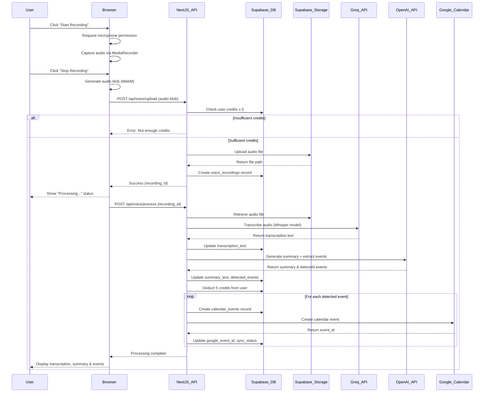
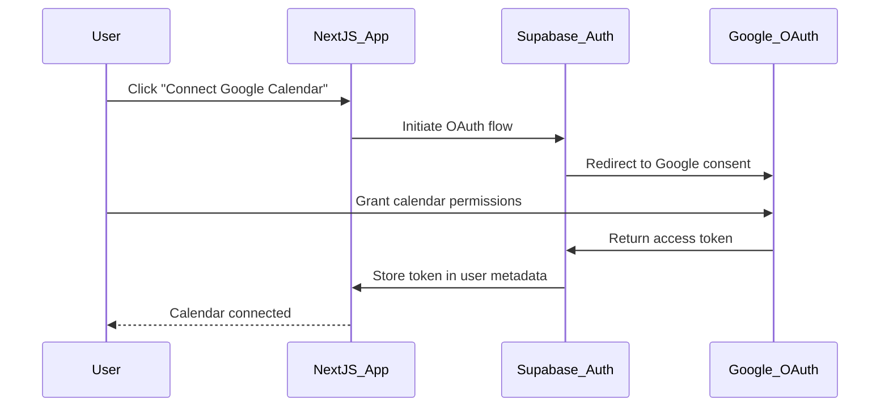

# Voice Recording and Summarization with Calendar Integration

## Feature Overview

This feature adds voice recording, transcription, AI summarization, and automatic Google Calendar event creation to the existing EdTech AI SaaS dashboard. Users can record voice notes, meetings, or lectures, receive AI-generated summaries, and have relevant calendar events created automatically from detected mentions.

## Strategic Goals

### Business Objectives
- Expand platform utility beyond PDF-based content to audio-based learning and productivity
- Leverage existing credit system to monetize voice transcription and AI processing
- Integrate with Google Calendar to provide end-to-end productivity workflow
- Maintain consistent user experience within existing dashboard architecture

### User Value Proposition
- Capture voice notes, lectures, or meeting recordings directly in the browser
- Automatically transcribe audio to text using free/affordable tools
- Generate intelligent summaries highlighting key points and action items
- Auto-create Google Calendar events from detected appointments, meetings, or deadlines
- Access all recordings and summaries in one centralized location

## Integration Architecture

### Positioning within Existing Application

The voice recording feature will be integrated as a new section within the existing dashboard, maintaining architectural consistency with current features.

**Dashboard Navigation Structure:**
- Existing: Dashboard Home, Generate (AI), Credits
- New: Voice Notes (new menu item)

**URL Structure:**
- Main interface: `/dashboard/voice`
- Individual recording view: `/dashboard/voice/[recordingId]`

**Authentication & Authorization:**
- Reuse existing Supabase authentication middleware
- Apply same user session management as current dashboard pages
- Enforce authenticated-only access

### Database Schema Extension

New tables to be added to existing Supabase database:

**Table: voice_recordings**

| Column Name | Type | Constraints | Purpose |
|------------|------|-------------|---------|
| id | UUID | Primary Key, Default: uuid_generate_v4() | Unique identifier |
| user_id | UUID | Foreign Key (auth.users), NOT NULL | Owner of recording |
| title | TEXT | NOT NULL | User-defined or auto-generated title |
| audio_file_path | TEXT | NOT NULL | Path in Supabase Storage |
| duration_seconds | INTEGER | NOT NULL | Recording length |
| transcription_text | TEXT | NULLABLE | Full transcription content |
| summary_text | TEXT | NULLABLE | AI-generated summary |
| detected_events | JSONB | NULLABLE | Parsed calendar event data |
| calendar_sync_status | TEXT | Default: 'pending' | Status: pending, synced, failed |
| credits_used | INTEGER | NOT NULL | Credits consumed for processing |
| created_at | TIMESTAMP | Default: now() | Creation timestamp |
| updated_at | TIMESTAMP | Default: now() | Last update timestamp |

**Table: calendar_events**

| Column Name | Type | Constraints | Purpose |
|------------|------|-------------|---------|
| id | UUID | Primary Key, Default: uuid_generate_v4() | Unique identifier |
| recording_id | UUID | Foreign Key (voice_recordings), NOT NULL | Source recording |
| user_id | UUID | Foreign Key (auth.users), NOT NULL | Event owner |
| google_event_id | TEXT | NULLABLE | Google Calendar event ID |
| event_title | TEXT | NOT NULL | Calendar event title |
| event_description | TEXT | NULLABLE | Event details |
| event_start | TIMESTAMP | NOT NULL | Event start time |
| event_end | TIMESTAMP | NULLABLE | Event end time |
| sync_status | TEXT | Default: 'pending' | Status: pending, synced, failed |
| created_at | TIMESTAMP | Default: now() | Creation timestamp |

**Row Level Security (RLS) Policies:**
- Users can only read/write their own voice_recordings
- Users can only read/write their own calendar_events
- Service role can access all records for admin operations

### Storage Architecture

**Supabase Storage Bucket: voice-recordings**

- Bucket Visibility: Private (authenticated users only)
- File Naming Convention: `{user_id}/{timestamp}_{uuid}.webm`
- Maximum File Size: 50 MB per recording
- Allowed MIME Types: audio/webm, audio/mp4, audio/wav
- Storage Policy: Users can upload/read/delete only their own files

**Storage Lifecycle:**
- Upload: Client-side recording → direct upload to Supabase Storage
- Processing: Server retrieves file by path for transcription
- Retention: Files persist indefinitely unless user deletes
- Cleanup: Cascade delete when recording record is deleted

## User Workflow

### Recording and Processing Flow



### State Management Flow

**Recording States:**
1. **idle**: No active recording
2. **recording**: Audio being captured
3. **uploading**: File being sent to server
4. **processing**: Transcription and summarization in progress
5. **completed**: All processing finished, results available
6. **failed**: Error occurred, user can retry

**Calendar Sync States:**
1. **pending**: Event detected but not yet synced
2. **syncing**: API call to Google Calendar in progress
3. **synced**: Successfully created in Google Calendar
4. **failed**: Sync failed (user can retry or skip)

## Component Architecture

### Page Structure

**Dashboard Voice Page (`/app/dashboard/voice/page.tsx`)**

**Purpose**: Main interface for creating and viewing voice recordings

**Layout Sections:**
- Header: Page title, credit balance display, "New Recording" button
- Recording Interface: Active recording controls (shown when recording)
- Recordings List: Table/grid of past recordings with filters

**Recording Interface Elements:**
- Waveform visualization (optional, uses Web Audio API)
- Timer display (elapsed recording time)
- Pause/Resume controls
- Stop & Save button
- Delete recording button

**Recordings List Columns:**
- Title (editable inline)
- Duration
- Created date
- Status (Processing/Completed)
- Actions (View, Delete)

**Individual Recording Page (`/app/dashboard/voice/[recordingId]/page.tsx`)**

**Purpose**: Display detailed view of single recording

**Content Sections:**
- Audio Player: Playback controls with seek bar
- Transcription Tab: Full text transcription with timestamps (if available)
- Summary Tab: AI-generated bullet points and key insights
- Calendar Events Tab: List of detected events with sync status
- Metadata: Recording duration, credits used, creation date

**Calendar Events Display:**
Each detected event shows:
- Event title
- Date and time
- Description/context from transcription
- Sync status indicator
- Action buttons (Sync to Calendar, Edit, Remove)

### API Routes

**POST /api/voice/upload**

**Purpose**: Upload audio file and create initial recording record

**Request Body:**
- audio_blob: Binary audio data (multipart/form-data)
- title: Optional string (user-provided title)

**Authentication**: Required (Supabase session)

**Process Flow:**
1. Validate user session
2. Check file size ≤ 50MB
3. Verify MIME type is supported audio format
4. Check user has minimum 5 credits
5. Generate unique filename
6. Upload to Supabase Storage bucket
7. Create voice_recordings record (status: processing)
8. Return recording_id

**Response:**
- Success: { recording_id, file_path, status: "uploaded" }
- Error: { error: string, code: string }

**POST /api/voice/process**

**Purpose**: Transcribe audio, generate summary, extract calendar events

**Request Body:**
- recording_id: UUID

**Authentication**: Required (Supabase session)

**Process Flow:**
1. Validate user owns recording
2. Retrieve audio file from Supabase Storage
3. Convert audio to format compatible with Groq Whisper (if needed)
4. Call Groq Whisper API for transcription
5. Store transcription_text in database
6. Send transcription to OpenAI API with specialized prompt
7. Parse AI response for summary and event extraction
8. Store summary_text and detected_events (JSONB)
9. Deduct credits from user balance (5 credits)
10. Return complete data

**AI Prompt Structure for Event Extraction:**

The prompt sent to OpenAI will instruct the model to:
- Summarize the transcription in 3-5 bullet points
- Identify any mentions of appointments, meetings, deadlines, or time-based commitments
- Extract event details: title, date/time, description
- Return structured JSON format

**Response Format:**
```
{
  transcription: string,
  summary: string,
  detected_events: [
    {
      title: string,
      start_datetime: ISO 8601 string,
      end_datetime: ISO 8601 string or null,
      description: string
    }
  ],
  credits_used: number
}
```

**POST /api/voice/calendar-sync**

**Purpose**: Create Google Calendar events from detected events

**Request Body:**
- recording_id: UUID
- event_ids: Array of event UUIDs to sync (allows selective sync)

**Authentication**: Required (Supabase session + Google OAuth)

**Process Flow:**
1. Validate user owns recording
2. Check user has authorized Google Calendar access
3. Retrieve event records from calendar_events table
4. For each event:
   - Call Google Calendar API to create event
   - Store google_event_id in database
   - Update sync_status to "synced"
5. Return sync results

**Response:**
```
{
  synced: number,
  failed: number,
  results: [
    { event_id: UUID, status: "synced"|"failed", google_event_id: string|null }
  ]
}
```

**GET /api/voice/recordings**

**Purpose**: Fetch user's recordings with pagination and filtering

**Query Parameters:**
- page: number (default: 1)
- limit: number (default: 20, max: 100)
- status: "processing"|"completed"|"failed" (optional filter)
- sort: "created_desc"|"created_asc"|"duration_desc" (default: created_desc)

**Authentication**: Required (Supabase session)

**Response:**
```
{
  recordings: [
    {
      id: UUID,
      title: string,
      duration_seconds: number,
      status: string,
      created_at: timestamp,
      has_summary: boolean,
      event_count: number
    }
  ],
  total: number,
  page: number,
  pages: number
}
```

**DELETE /api/voice/recordings/[id]**

**Purpose**: Delete recording and associated data

**Authentication**: Required (Supabase session)

**Process Flow:**
1. Validate user owns recording
2. Delete audio file from Supabase Storage
3. Delete calendar_events records (cascade)
4. Delete voice_recordings record
5. Optionally delete synced Google Calendar events (user confirmation)

## Technology Selection

### Voice Recording Technology

**Web MediaRecorder API (Browser-based)**

**Selection Rationale:**
- Completely free, no external service required
- Native browser support (Chrome, Firefox, Safari, Edge)
- Direct access to user microphone with permissions
- Produces compressed audio formats (WebM, MP4)

**Implementation Approach:**
- Request microphone permission via getUserMedia API
- Initialize MediaRecorder with audio constraints
- Capture audio chunks in dataavailable event
- Combine chunks into Blob on stop event
- Upload Blob to server

**Browser Compatibility Handling:**
- Feature detection before enabling recording
- Provide fallback message for unsupported browsers
- Recommend Chrome/Firefox for best experience

### Transcription Service

**Groq Whisper API (Free Tier)**

**Selection Rationale:**
- Free tier available with generous limits
- Uses OpenAI's Whisper model (state-of-the-art accuracy)
- Faster processing than OpenAI's hosted Whisper
- Simple REST API integration
- Supports multiple audio formats

**API Integration Details:**
- Endpoint: https://api.groq.com/openai/v1/audio/transcriptions
- Model: whisper-large-v3
- Supported formats: WebM, MP4, WAV, FLAC
- Max file size: 25 MB (if recording exceeds, chunk it)
- Response format: JSON with text transcription

**Free Tier Limits (as of design):**
- Generous audio minutes per month
- Rate limiting applies (handle with retry logic)
- Fallback: User can manually retry if quota exceeded

### AI Summarization and Event Extraction

**OpenAI API (Existing Integration)**

**Selection Rationale:**
- Already integrated in existing application
- User already has API key configured
- GPT-4 excels at summarization and structured data extraction
- Can process long transcriptions efficiently

**Model Selection:**
- Use gpt-4o-mini (cost-effective, fast)
- Context window sufficient for typical recordings
- If transcription exceeds token limit, chunk and summarize in stages

**Prompt Engineering Strategy:**

The system will send a structured prompt instructing the model to:
1. Provide a concise summary with key points
2. Extract any time-based commitments mentioned
3. Return response in JSON format for parsing

**Example Prompt Structure:**

```
Task: Analyze the following transcription and provide:
1. A summary in 3-5 bullet points
2. Extract any calendar events mentioned (meetings, appointments, deadlines)

Transcription:
{transcription_text}

Return JSON format:
{
  "summary": ["point 1", "point 2", ...],
  "events": [
    {
      "title": "event name",
      "datetime": "ISO 8601 format or null if unclear",
      "description": "context from transcription"
    }
  ]
}

Rules:
- Only extract events with clear date/time references
- Use ISO 8601 format for datetime
- If date/time is ambiguous, set datetime to null
- Include original context in description
```

### Calendar Integration

**Google Calendar API (Free)**

**Selection Rationale:**
- Free to use with Google Cloud project
- Most widely used calendar platform
- OAuth 2.0 integration available via Supabase
- Comprehensive API for event creation/management

**Authentication Flow:**



**OAuth Scopes Required:**
- https://www.googleapis.com/auth/calendar.events (create/read/update events)

**Token Management:**
- Store access token in Supabase user metadata
- Store refresh token for long-term access
- Implement token refresh logic when expired
- Handle revocation gracefully

**Event Creation API Call:**

Endpoint: POST https://www.googleapis.com/calendar/v3/calendars/primary/events

Request body structure:
```
{
  "summary": "Event title",
  "description": "Event description with context",
  "start": {
    "dateTime": "ISO 8601 timestamp",
    "timeZone": "User's timezone"
  },
  "end": {
    "dateTime": "ISO 8601 timestamp",
    "timeZone": "User's timezone"
  },
  "reminders": {
    "useDefault": true
  }
}
```

**Error Handling:**
- Token expired: Refresh and retry
- Permission revoked: Prompt user to reconnect
- API quota exceeded: Queue events for later sync
- Event conflict: Allow user to resolve

## Credit System Integration

### Credit Consumption Model

**Credit Deduction Rules:**

| Action | Credits Deducted | Timing |
|--------|------------------|--------|
| Voice transcription + summarization | 5 credits | After successful processing |
| Failed processing | 0 credits | No charge for failures |
| Re-processing same recording | 2 credits | User-initiated retry |
| Calendar sync | 0 credits | Free add-on |

**Credit Check Points:**
1. Before allowing upload (minimum 5 credits required)
2. Before processing (verify credits still available)
3. After successful processing (atomic deduction)

**Insufficient Credits Handling:**
- Display credit balance prominently in voice page header
- Disable "Record" button if credits < 5
- Show "Buy Credits" link inline
- Prevent upload API call from proceeding

**Credit Deduction Implementation:**

The API will use Supabase RPC (Remote Procedure Call) for atomic credit deduction:

**Database Function Logic:**
1. Begin transaction
2. Lock user credits row
3. Verify current balance ≥ required amount
4. Deduct credits
5. Log transaction in credits_transactions table
6. Commit transaction
7. Return new balance

**Transaction Logging:**

Extend or create credits_transactions table to log:
- transaction_id (UUID)
- user_id (UUID)
- amount (integer, negative for deductions)
- transaction_type (enum: "voice_processing", "voice_retry")
- related_entity_id (recording_id)
- timestamp

**Free Tier Consideration:**

Users receive 10 free credits initially:
- Can process 2 voice recordings without payment
- Encourages trial usage
- Consistent with existing PDF generation feature

## User Interface Design

### Dashboard Voice Page Layout

**Header Section:**
- Page title: "Voice Notes"
- Credit balance badge (e.g., "25 credits")
- Primary action: "New Recording" button (prominent, accent color)

**Recording Interface (shown when active):**

**Visual Elements:**
- Large circular record button (red when recording, pulsing animation)
- Timer display in MM:SS format
- Waveform visualization (animated bars representing audio levels)
- Control buttons: Pause/Resume, Stop & Save, Cancel

**Visual States:**
- Idle: Large "Start Recording" button
- Recording: Pulsing red circle, active waveform, timer
- Paused: Paused icon, static waveform, timer frozen
- Processing: Upload progress bar, "Processing..." message

**Recordings List Section:**

**Table View:**

| Title | Duration | Created | Status | Actions |
|-------|----------|---------|--------|---------|
| [Editable text] | 5:23 | Dec 6, 2024 | Completed ✓ | View • Delete |
| [Editable text] | 12:45 | Dec 5, 2024 | Processing... | View • Delete |

**Card View (alternative for mobile):**
- Card per recording
- Shows title, duration, date, status badge
- Tap to view details

**Filters and Sorting:**
- Filter by status: All, Completed, Processing
- Sort by: Date (newest/oldest), Duration (longest/shortest)
- Search by title

### Individual Recording Page Layout

**Audio Player Section:**
- Standard HTML5 audio controls
- Playback speed control (1x, 1.5x, 2x)
- Download audio button

**Tab Navigation:**
1. Summary (default)
2. Full Transcription
3. Calendar Events (badge shows count)

**Summary Tab:**
- Heading: "AI Summary"
- Bullet list of key points
- "Regenerate Summary" button (costs 2 credits)

**Transcription Tab:**
- Full text display
- Copy to clipboard button
- Download as .txt button
- Optional: Timestamp markers (if available from Whisper)

**Calendar Events Tab:**

**Event Card Layout (per detected event):**
- Event title (large, bold)
- Date and time display
- Description text (context from transcription)
- Sync status indicator:
  - Pending: Yellow dot, "Not synced"
  - Synced: Green checkmark, "Added to calendar"
  - Failed: Red X, "Sync failed - Retry"
- Action buttons:
  - "Add to Calendar" (if not synced)
  - "View in Calendar" (if synced, opens Google Calendar)
  - "Edit" (modify before syncing)
  - "Remove" (delete from list)

**Empty State:**
- No events detected: "No calendar events found in this recording"
- Icon and suggestion to manually add events

**Google Calendar Connection:**

If user hasn't connected Google Calendar:
- Banner: "Connect Google Calendar to automatically add events"
- "Connect Calendar" button → triggers OAuth flow

### Responsive Design Considerations

**Desktop (≥1024px):**
- Two-column layout: Recordings list + Recording interface side-by-side
- Full table view for recordings
- Expanded waveform visualization

**Tablet (768px - 1023px):**
- Stacked layout: Recording interface above list
- Table view with fewer columns
- Collapsible filters

**Mobile (< 768px):**
- Full-screen recording interface when active
- Card view for recordings list
- Bottom sheet for filters
- Simplified waveform (fewer bars)

## Data Flow Architecture

### Recording Creation Flow

**Step 1: User Initiates Recording**
- User clicks "New Recording" button
- Frontend checks credit balance via state management
- If credits ≥ 5, enable microphone access
- If credits < 5, show "Insufficient credits" modal

**Step 2: Audio Capture**
- Browser requests microphone permission
- User grants permission
- MediaRecorder starts capturing audio stream
- Frontend displays recording UI with timer and waveform
- Audio chunks stored in memory

**Step 3: Recording Completion**
- User clicks "Stop & Save"
- MediaRecorder stops, triggers dataavailable event
- Combine audio chunks into single Blob
- Prompt user for optional title
- Prepare multipart/form-data request

**Step 4: Upload to Server**
- POST request to /api/voice/upload with audio Blob
- Backend validates session and credits
- Upload audio to Supabase Storage (voice-recordings bucket)
- Create voice_recordings database record with status "processing"
- Return recording_id to frontend

**Step 5: Background Processing**
- Frontend automatically triggers /api/voice/process
- Display "Processing..." status in UI
- User can navigate away; processing continues server-side

### Processing and Transcription Flow

**Step 1: Retrieve Audio File**
- Backend receives recording_id
- Query voice_recordings table for file_path
- Download audio file from Supabase Storage
- Validate file integrity

**Step 2: Transcription via Groq**
- Prepare audio file for Groq API (convert format if needed)
- POST to Groq Whisper API endpoint
- Receive transcription text response
- Store transcription_text in database
- Update recording status

**Step 3: AI Summarization**
- Send transcription to OpenAI API with structured prompt
- Request summary and event extraction
- Parse JSON response
- Validate extracted event data (dates, times)

**Step 4: Event Detection and Parsing**
- Extract events array from AI response
- For each detected event:
  - Parse datetime string to timestamp
  - Validate date is in future (warn if past)
  - Create calendar_events record
  - Link to recording_id and user_id
  - Set sync_status to "pending"

**Step 5: Credit Deduction**
- Call Supabase RPC function to deduct 5 credits
- Log transaction in credits_transactions table
- Update user credits balance in state

**Step 6: Completion**
- Update voice_recordings status to "completed"
- Trigger frontend notification (toast message)
- Refresh recordings list
- If user is viewing detail page, load transcription and summary

### Calendar Sync Flow

**Step 1: User Reviews Events**
- Navigate to recording detail page
- View Calendar Events tab
- Review detected events
- Optionally edit event details before syncing

**Step 2: Google Calendar Authorization Check**
- Frontend checks if user has connected Google Calendar
- If not connected:
  - Display "Connect Calendar" banner
  - User clicks connect → OAuth flow
  - Supabase handles Google OAuth
  - Store access token and refresh token
  - Return to recording page

**Step 3: Selective Sync**
- User selects which events to sync (checkboxes)
- Or "Sync All" button for convenience
- Confirm timezone detection (use browser timezone)

**Step 4: API Call to Create Events**
- POST to /api/voice/calendar-sync with event_ids
- Backend validates Google token (refresh if expired)
- For each event:
  - Format event data for Google Calendar API
  - POST to Google Calendar API
  - Receive google_event_id
  - Update calendar_events record
  - Set sync_status to "synced"

**Step 5: Sync Status Update**
- Frontend polls or receives webhook notification
- Update UI to show green checkmarks
- Display success toast: "3 events added to your calendar"
- Show "View in Calendar" links

**Error Handling in Sync:**
- If individual event fails: Mark as failed, continue with others
- If token expired: Refresh and retry
- If permission revoked: Prompt to reconnect
- If API quota exceeded: Queue for later, notify user

## Edge Cases and Error Handling

### Recording Edge Cases

**Microphone Permission Denied:**
- Display user-friendly message explaining permission is required
- Provide instructions to enable in browser settings
- Offer link to help documentation

**Recording Interrupted (browser crash, tab closed):**
- MediaRecorder has no persistent state
- Lost recording cannot be recovered
- Prevention: Display warning before user closes tab if recording active
- Use beforeunload event listener

**Maximum Recording Length:**
- Implement maximum duration (e.g., 2 hours)
- Auto-stop at limit and prompt user to save
- Display remaining time warning at 5 minutes left
- Split very long recordings into chunks if needed

**Audio Format Incompatibility:**
- MediaRecorder produces different formats per browser
- Backend accepts multiple formats (WebM, MP4, WAV)
- Convert server-side if Groq requires specific format
- Use FFmpeg or similar tool for conversion

**File Size Exceeds Storage Limit:**
- Check file size before upload
- If > 50MB, reject with error message
- Suggest user record shorter segments
- Compress audio if possible (lower bitrate)

### Transcription Edge Cases

**Groq API Rate Limit Exceeded:**
- Catch rate limit error (HTTP 429)
- Implement exponential backoff retry logic
- Maximum 3 retry attempts
- If still failing, notify user: "Service temporarily busy, try again later"
- Allow manual retry button

**Groq Free Tier Quota Exhausted:**
- Detect quota error from API response
- Inform user of temporary service limitation
- Offer alternative: "Processing paused, will resume when quota resets"
- Consider fallback to OpenAI Whisper if user has high credit balance

**Poor Audio Quality (inaudible, noisy):**
- Groq will return transcription even if low confidence
- If transcription is very short despite long recording, warn user
- Provide transcription confidence score if available from API
- Allow user to re-record or manually edit transcription

**Silent Audio (no speech detected):**
- If transcription returns empty or very minimal text
- Display message: "No speech detected in recording"
- Offer to delete and re-record
- Do not charge credits if transcription is empty

**Non-English Language:**
- Whisper model supports multiple languages automatically
- Groq API auto-detects language
- Summarization may work poorly for non-English
- Future enhancement: Allow user to specify language

### AI Processing Edge Cases

**Transcription Exceeds Token Limit:**
- GPT-4o-mini has ~128k token context window
- Typical 1-hour audio → ~10k tokens transcription
- If exceeds limit: Chunk transcription into segments
- Summarize each chunk, then combine summaries
- Ensure event extraction covers all chunks

**No Events Detected:**
- AI returns empty events array
- Display message: "No calendar events found"
- Provide empty state UI
- User can manually add events via form

**Ambiguous Date/Time References:**
- AI extracts event but datetime is null or unclear
- Example: "meeting next Tuesday" without current date context
- Display event with warning: "Date unclear - please specify"
- Provide date picker for user to correct
- Do not sync to calendar until date confirmed

**Incorrect Event Extraction (false positives):**
- AI misinterprets casual mentions as events
- Example: "I wish we had a meeting" → not actual meeting
- User can review and delete false positives before syncing
- Provide "Remove" button on each event card
- Learn from user patterns (future enhancement)

**API Timeout:**
- OpenAI API call takes too long
- Set timeout limit (e.g., 60 seconds)
- If timeout, retry once
- If still failing, save partial results (transcription only)
- Allow user to regenerate summary later

### Calendar Sync Edge Cases

**User Disconnects Google Calendar:**
- Detect revoked OAuth token error
- Display banner: "Google Calendar disconnected"
- Provide "Reconnect" button
- Prevent sync attempts until reconnected
- Preserve pending events for future sync

**Duplicate Event Prevention:**
- User accidentally syncs same event twice
- Backend checks if google_event_id already exists
- Skip creation, return "already synced" status
- Frontend shows status: "Already in calendar"

**Timezone Mismatch:**
- User records in one timezone, syncs in another
- Use browser-detected timezone by default
- Allow user to override timezone per event
- Display timezone clearly in event preview

**Past Date Detected:**
- AI extracts event with past date (e.g., mentioned historical meeting)
- Validate event start date > current date
- Display warning badge: "Past date detected"
- Allow user to confirm if intentional (e.g., reminder)

**All-Day Event vs. Timed Event:**
- AI may not specify exact time
- If only date mentioned, create all-day event
- If time mentioned, create timed event
- Provide toggle for user to switch between modes

**Calendar API Quota Exceeded:**
- Google Calendar API has quota limits
- Catch quota exceeded error
- Queue events for delayed sync
- Notify user: "Events will be added shortly"
- Implement background job to retry

## Security Considerations

### Authentication and Authorization

**User Authentication:**
- Leverage existing Supabase authentication
- All API routes require valid session token
- Validate user_id matches session user_id
- Reject unauthenticated requests with 401

**Resource Ownership Validation:**
- Before any read/write operation on recordings
- Query database to verify current user owns resource
- Prevent horizontal privilege escalation
- Return 403 if ownership check fails

**Row Level Security (RLS):**
- Enable RLS on voice_recordings table
- Policy: Users can only SELECT/INSERT/UPDATE/DELETE their own records
- Enable RLS on calendar_events table
- Service role bypasses RLS for admin operations

### Data Privacy

**Audio File Access:**
- Supabase Storage bucket set to private
- Generate signed URLs for audio playback (time-limited)
- URLs expire after 1 hour
- Regenerate URL on each page load

**Transcription Data:**
- Contains potentially sensitive spoken information
- Store encrypted at rest in Supabase (handled by platform)
- Transmit over HTTPS only
- Do not log transcription content in server logs

**Google Calendar Tokens:**
- Store OAuth tokens in Supabase user metadata (encrypted)
- Never expose tokens to frontend
- Use refresh tokens to regenerate access tokens
- Implement token rotation

**User Data Deletion:**
- Provide "Delete Recording" function
- Cascade delete: Audio file + DB records + calendar events
- Optionally remove from Google Calendar (prompt user)
- Permanent deletion, no recovery (confirm with user)

### Input Validation

**Audio File Upload:**
- Validate MIME type matches allowed list
- Verify file size within limits (≤ 50MB)
- Scan for malicious content (if feasible)
- Reject non-audio files

**API Request Validation:**
- Validate all request parameters (recording_id format, etc.)
- Sanitize user-provided titles (prevent XSS)
- Limit request rate per user (prevent abuse)
- Validate JSON payload structure

**Event Data Validation:**
- Sanitize event titles and descriptions before sending to Google API
- Validate datetime formats before parsing
- Prevent injection attacks in calendar data
- Limit event description length

### API Key Security

**Groq API Key:**
- Store in environment variables (never commit to repo)
- Access only from server-side code
- Never expose to frontend
- Rotate periodically

**OpenAI API Key:**
- Already secured in existing implementation
- Maintain same security practices
- Monitor usage for anomalies

**Google Calendar API Credentials:**
- Store OAuth client ID and secret in environment variables
- Use server-side OAuth flow
- Never expose client secret to frontend
- Implement OAuth PKCE flow if possible

### Rate Limiting

**Upload Endpoint:**
- Limit to 10 uploads per user per hour
- Prevent abuse and storage exhaustion
- Return 429 Too Many Requests if exceeded
- Reset counter hourly

**Processing Endpoint:**
- Limit to 20 requests per user per hour
- Prevent duplicate processing spam
- Queue requests if rate limited

**Calendar Sync Endpoint:**
- Limit to 50 syncs per user per day
- Protect Google API quota
- Inform user of limit

## Performance Optimization

### Audio Upload Optimization

**Client-Side Compression:**
- MediaRecorder uses compressed format (WebM) by default
- Configure bitrate for balance between quality and size
- Recommended: 128 kbps for voice (sufficient clarity)
- Results in ~1 MB per minute of audio

**Chunked Upload:**
- For very large files, implement chunked upload
- Upload in 5MB chunks
- Resume capability if connection interrupted
- Show progress bar during upload

**Background Upload:**
- Allow user to navigate away during upload
- Use service worker for background processing (future enhancement)
- Notify user when complete via toast or notification

### Transcription Performance

**File Format Optimization:**
- Convert to optimal format for Groq (if needed)
- Use server-side FFmpeg for fast conversion
- Cache converted files temporarily

**Parallel Processing:**
- If chunking long audio, process chunks in parallel
- Combine transcriptions sequentially
- Reduces total processing time

**Caching:**
- Cache transcription results in database
- If user re-processes, check if transcription exists
- Only regenerate summary (2 credits) vs. full process (5 credits)

### Database Query Optimization

**Indexing:**
- Create index on voice_recordings.user_id (filter queries)
- Create index on voice_recordings.created_at (sorting)
- Create index on calendar_events.recording_id (joins)
- Composite index on (user_id, created_at) for common queries

**Pagination:**
- Implement cursor-based pagination for large datasets
- Limit results per page (default 20, max 100)
- Load more on scroll (infinite scroll) or page buttons

**Selective Field Loading:**
- Only query needed columns in list view
- Load full transcription only when detail page opened
- Use Supabase select() to specify columns

### Frontend Performance

**Code Splitting:**
- Lazy load recording components when needed
- Dynamic import for audio visualization library
- Reduce initial bundle size

**Audio Visualization Optimization:**
- Use Web Audio API for waveform rendering
- Throttle animation updates to 60fps
- Render on canvas for performance
- Disable on low-end devices (feature detection)

**State Management:**
- Use React Context or Zustand for global state
- Memoize expensive calculations
- Debounce search/filter inputs

## Testing Strategy

### Unit Testing

**Audio Recording Logic:**
- Test MediaRecorder initialization
- Mock getUserMedia for permission scenarios
- Test audio chunk combination logic
- Validate blob creation and file size

**API Route Handlers:**
- Test upload endpoint with valid/invalid files
- Test credit checking logic
- Test database record creation
- Mock Supabase client responses

**Event Extraction Parsing:**
- Test AI response parsing with various formats
- Test datetime validation
- Test empty event array handling
- Test malformed JSON responses

### Integration Testing

**End-to-End Recording Flow:**
- Record mock audio in test environment
- Verify upload to Supabase Storage
- Verify database record creation
- Check credit deduction

**Transcription Pipeline:**
- Upload test audio file
- Mock Groq API response with sample transcription
- Verify transcription stored in database
- Test summarization with mocked OpenAI response

**Calendar Sync Flow:**
- Mock Google Calendar API
- Create test events
- Verify API calls with correct parameters
- Check database sync status updates

### Manual Testing Checklist

**Recording Functionality:**
- [ ] Microphone permission request works
- [ ] Recording starts and stops correctly
- [ ] Timer updates accurately
- [ ] Waveform animates during recording
- [ ] Audio playback works after upload
- [ ] Different browsers (Chrome, Firefox, Safari, Edge)

**Transcription Accuracy:**
- [ ] Clear speech transcribed accurately
- [ ] Background noise handled reasonably
- [ ] Multiple speakers distinguished (if possible)
- [ ] Non-English languages detected
- [ ] Summary captures key points

**Calendar Integration:**
- [ ] OAuth connection flow completes
- [ ] Events appear in Google Calendar
- [ ] Correct timezone applied
- [ ] Event details match transcription context
- [ ] Delete/edit events syncs properly

**Error Scenarios:**
- [ ] Insufficient credits shows error
- [ ] Network interruption during upload
- [ ] Groq API failure handled gracefully
- [ ] Google Calendar permission denied
- [ ] Invalid audio format rejected

**Responsive Design:**
- [ ] Desktop layout displays correctly
- [ ] Tablet view adjusts properly
- [ ] Mobile recording interface usable
- [ ] Touch gestures work on mobile

## Future Enhancements

### Phase 2 Features (Post-MVP)

**Speaker Diarization:**
- Identify different speakers in recording
- Label transcription by speaker
- Useful for meeting notes

**Timestamped Transcription:**
- Display transcription with timestamps
- Sync audio playback with text highlighting
- Allow jumping to specific sections

**Collaborative Features:**
- Share recordings with team members
- Collaborative editing of summaries
- Comment on specific sections

**Advanced Calendar Features:**
- Detect recurring events
- Send calendar invites to mentioned participants
- Sync with multiple calendar platforms (Outlook, Apple Calendar)

**Voice Commands:**
- Start/stop recording via voice command
- Hands-free operation
- Useful for accessibility

**Export Options:**
- Export transcription as PDF, Word, or Markdown
- Email summary to specified address
- Integration with note-taking apps (Notion, Evernote)

**Analytics:**
- Track total recording time
- Most common topics/keywords
- Credit usage analytics

**Custom AI Prompts:**
- Allow users to customize summarization style
- Templates for different use cases (meetings, lectures, interviews)
- Save prompt preferences

**Multi-Language Support:**
- Explicit language selection for transcription
- Translate transcription to different language
- Bilingual summaries

**Audio Editing:**
- Trim silence from beginning/end
- Remove filler words
- Speed up/slow down playback

## Success Metrics

### Key Performance Indicators (KPIs)

**Adoption Metrics:**
- Number of users creating first recording
- Percentage of users recording >3 times per week
- Recording feature usage vs. PDF generation

**Engagement Metrics:**
- Average recordings per user per month
- Average recording duration
- Transcription view rate (% users viewing full transcription)
- Summary regeneration rate

**Calendar Integration Metrics:**
- Percentage of users connecting Google Calendar
- Average events synced per recording
- Event sync success rate
- User corrections to detected events (measure accuracy)

**Business Metrics:**
- Credits consumed by voice feature
- Conversion rate: free users → paid (for voice credits)
- Revenue from voice-related credit purchases
- Customer satisfaction score for voice feature

**Technical Metrics:**
- Average transcription processing time
- API error rate (Groq, OpenAI, Google Calendar)
- Audio upload success rate
- Storage usage growth rate

### Success Criteria (3-Month Post-Launch)

- At least 40% of active users try voice recording
- 70% of users who record once, record again within 7 days
- 60% of voice users connect Google Calendar
- 85% transcription success rate (no errors)
- Average processing time < 2 minutes for 10-minute recording
- Event detection accuracy > 75% (user-confirmed events / total detected)

## Deployment Considerations

### Environment Variables Required

Add to existing `.env.local`:

```
# Groq API
GROQ_API_KEY=your_groq_api_key

# Google Calendar OAuth
GOOGLE_CALENDAR_CLIENT_ID=your_google_client_id
GOOGLE_CALENDAR_CLIENT_SECRET=your_google_client_secret
GOOGLE_CALENDAR_REDIRECT_URI=https://your-domain.com/api/auth/callback/google
```

### Database Migration Steps

1. Create voice_recordings table with schema defined above
2. Create calendar_events table with schema defined above
3. Apply Row Level Security policies
4. Create indexes for performance
5. Set up foreign key constraints
6. Create Supabase RPC function for credit deduction
7. Test migrations on staging database before production

### Supabase Storage Setup

1. Create new bucket named "voice-recordings"
2. Set bucket to private (not public)
3. Configure storage policies:
   - Users can upload to their own folder (user_id)
   - Users can read from their own folder
   - Users can delete from their own folder
4. Set file size limit to 50 MB
5. Configure allowed MIME types

### Google Cloud Project Setup

1. Create new Google Cloud project (or use existing)
2. Enable Google Calendar API
3. Configure OAuth consent screen
4. Add authorized redirect URIs (Supabase callback)
5. Create OAuth 2.0 credentials (client ID and secret)
6. Add scopes: calendar.events
7. Verify domain ownership if publishing app

### Supabase OAuth Configuration

1. Navigate to Supabase Dashboard → Authentication → Providers
2. Enable Google provider
3. Enter Google OAuth client ID and secret
4. Configure redirect URLs
5. Test OAuth flow in development environment
6. Update production settings separately

### Deployment Checklist

**Pre-Deployment:**
- [ ] Database migrations tested and ready
- [ ] Environment variables configured in Vercel
- [ ] Supabase storage bucket created
- [ ] Google Calendar API enabled and credentials obtained
- [ ] Groq API key obtained and tested
- [ ] All API routes tested locally
- [ ] Frontend build successful without errors

**Deployment:**
- [ ] Run database migrations on production Supabase
- [ ] Deploy to Vercel (or hosting platform)
- [ ] Verify environment variables loaded
- [ ] Test OAuth flow in production
- [ ] Upload test recording end-to-end
- [ ] Verify calendar sync works

**Post-Deployment:**
- [ ] Monitor error logs for first 24 hours
- [ ] Check Groq API usage and quota
- [ ] Verify Supabase storage usage
- [ ] Test on multiple devices and browsers
- [ ] Gather initial user feedback
- [ ] Monitor credit deduction accuracy

### Rollback Plan

If critical issues arise post-deployment:

1. Disable feature flag (if implemented)
2. Remove "Voice Notes" menu item from dashboard navigation
3. Keep database tables and data intact
4. Investigate and fix issues in staging
5. Re-deploy when stable
6. Communicate downtime to users if necessary

Alternatively, implement feature flag from start:
- Environment variable: ENABLE_VOICE_FEATURE=true/false
- Conditionally render UI and API routes
- Allows quick disable without full rollback

## Conclusion

This design provides a comprehensive blueprint for adding voice recording, transcription, summarization, and calendar integration to the EdTech AI SaaS platform. The feature leverages free and affordable tools (MediaRecorder API, Groq Whisper, existing OpenAI integration, Google Calendar API) while integrating seamlessly with the existing credit system and authentication infrastructure.

The implementation prioritizes user experience with intuitive recording controls, intelligent event detection, and one-click calendar sync, while maintaining security, performance, and scalability standards consistent with the existing application.
